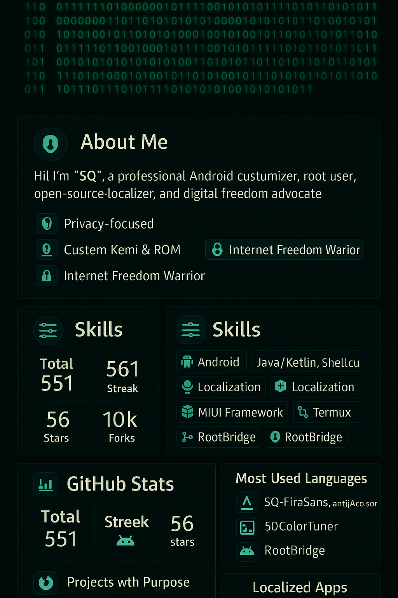

  
  

    <svg width="300" height="100" viewBox="0 0 300 100" xmlns="http://www.w3.org/2000/svg">
      <circle cx="50" cy="50" r="20" fill="none" stroke="#1E90FF" stroke-width="2">
        <animate attributeName="r" from="20" to="30" dur="1.5s" repeatCount="indefinite" />
      </circle>
      <path d="M50 50 L80 20" stroke="#FFD700" stroke-width="2" stroke-linecap="round">
        <animate attributeName="stroke-dasharray" from="0 30" to="30 30" dur="1s" repeatCount="indefinite" />
      </path>
      <path d="M50 50 L20 80" stroke="#FFD700" stroke-width="2" stroke-linecap="round">
        <animate attributeName="stroke-dasharray" from="0 30" to="30 30" dur="1.2s" repeatCount="indefinite" />
      </path>
      <g transform="translate(150, 50)">
        <rect x="-10" y="-10" width="20" height="20" fill="#4285F4">
          <animateTransform attributeName="transform" type="rotate" from="0 0 0" to="360 0 0" dur="3s" repeatCount="indefinite"/>
        </rect>
      </g>
    </svg>
  

  
  
  
  
  

<h1 align="center"> SQ — Developer of Root Power, Free Internet, and Digital Freedom</h1>

Open-source software developer | Focused on Android customization | Passionate about FOSS and privacy | Solving sanctions issues for free resource access for Iranian users.
Aiming to build free and practical tools | Most of my projects are on GitHub! Free download tools for YouTube, Instagram, and TikTok (yt-dlp), root modules and utilities for Android (Cromite, TelePro), kernel optimization (SQ-Kernel)| 
       
<a href="https://github.com/SQSh1/SQSh1">[ Persian 🇮🇷 ]</a>

---

## • About Me

Hello! I am SQ — a professional developer in the Android and Linux world, focused on:

- Building open-source tools with a priority on privacy
- Developing and optimizing WebView, browsers, and system modules
- Designing Magisk and LSPosed modules for advanced system control
- Contributing and collaborating to advance FOSS projects
- Localizing software for Persian-speaking users, focusing on privacy violations and sanction-related access issues
- Removing barriers to provide free internet access for all

---

## • Active Personal Projects

  yt-dlp-link-maker <svg width="20" height="20"><path d="M10 2 L18 10 L10 18" fill="none" stroke="#1E90FF" stroke-width="2"><animate attributeName="opacity" from="0" to="1" dur="1s" fill="freeze"/></svg> 
  yt-dlp-api-server <svg width="20" height="20"><circle cx="10" cy="10" r="5" fill="#FFD700"><animate attributeName="r" from="5" to="7" dur="1s" repeatCount="indefinite"/></svg> 
  yt-dlp-telegram-bot <svg width="20" height="20"><path d="M5 5 L15 15" stroke="#4285F4" stroke-width="2"><animate attributeName="stroke-dasharray" from="0 20" to="20 20" dur="1s" repeatCount="indefinite"/></svg> 
  TelePro <svg width="20" height="20"><rect x="5" y="5" width="10" height="10" fill="#00AF9C"><animate attributeName="opacity" from="0" to="1" dur="1s" fill="freeze"/></svg> 
  Kernel <svg width="20" height="20"><circle cx="10" cy="10" r="5" fill="#FCC624"><animateTransform attributeName="transform" type="rotate" from="0 10 10" to="360 10 10" dur="2s" repeatCount="indefinite"/></svg> 
  cromite-magisk <svg width="20" height="20"><path d="M5 15 L15 5" stroke="#3DDC84" stroke-width="2"><animate attributeName="stroke-dasharray" from="0 20" to="20 20" dur="1.5s" repeatCount="indefinite"/></svg> 
  webview_myket_video <svg width="20" height="20"><rect x="5" y="5" width="10" height="10" fill="#4285F4"><animate attributeName="height" from="10" to="15" dur="1s" repeatCount="indefinite"/></svg> 
  PrivBrowse <svg width="20" height="20"><path d="M10 2 L18 10 L10 18 L2 10 Z" fill="none" stroke="#FF4500" stroke-width="2"><animate attributeName="stroke-opacity" from="0.3" to="1" dur="1.2s" repeatCount="indefinite"/></svg>

## • Forked and FOSS Projects

  oblivion <svg width="20" height="20"><path d="M5 10 Q10 5 15 10" fill="none" stroke="#FFD700" stroke-width="2"><animate attributeName="stroke-dasharray" from="0 20" to="20 20" dur="2s" repeatCount="indefinite"/></svg> 
  <a href="https://github.com/bepass-org/oblivion">One of the top Iranian and popular projects</a>

## • Cromite Project (Fork of Bromite) with a focus on user privacy and practical settings, Time Zone change, User Agent modification, User Script application, Ad blocking
### • https://github.com/bromite/bromite
### • https://github.com/uazo/cromite

### • PrivBrowse
A Chromium-based browser focused on security, freedom, and an Iranian experience:

- • Ability to change and simulate Timezone
- • More than 15 selectable User-Agents (Safari, Firefox, mobile, and desktop)
- • Full support for SOCKS5 proxy and .pass tunneling
- 🇮🇷 Optimized and Persian UI for easy use in Iran  
> • Status: Actively under development  
> • Initial version coming soon!

### • yt-dlp-serverless
Creating an advanced downloader project (Advanced.html) to reduce server purchase and maintenance costs. Looking for sponsors to build it soon. Adding a backend server and real format outputs with a frontend to make you independent from downloaders forever.

---

## • Skills and Technologies

  
  
  
  
  
  
  

---

## 📬 Contact Me

  Work Email: <a href="mailto:developer.sqsh@gmail.com">developer.sqsh@gmail.com</a> 
  Telegram: <a href="https://t.me/SQ_Shabani">@SQ_Shabani</a> *(to be activated if needed)* 
  Website: Under construction 
  Collaboration? Just submit a strong Pull Request 💪

---

## ☕ Support Me

If you use the tools I build or care about digital freedom:

- • Star my projects
- • Follow for updates
- • Message me anytime or suggest a collaboration

<b>On the path to digital freedom, no wall is higher than will.</b>

